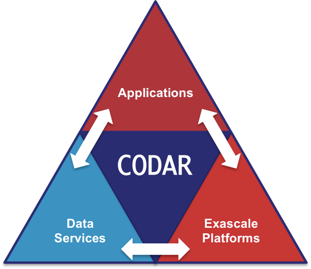

  

    <h1>About SDRBench</h1>
    
Contributors, acknowledgments, and sponsors of the Scientific Data Reduction Benchmarks project.

  

## Contributors & Maintainers

<ul class="contributors">
  <li><strong>F. Cappello</strong> (ANL, lead)</li>
  <li><strong>S. Di</strong> (ANL)</li>
  <li><strong>R. Underwood</strong> (ANL)</li>
  <li><strong>M. Ainsworth</strong> (Brown University)</li>
  <li><strong>J. Bessac</strong> (ANL)</li>
  <li><strong>Martin Burtscher</strong> (Texas State University)</li>
  <li><strong>Jong Youl Choi</strong> (ORNL)</li>
  <li><strong>E. Constantinescu</strong> (ANL)</li>
  <li><strong>H. Guo</strong> (ANL)</li>
  <li><strong>Peter Lindstrom</strong> (LLNL)</li>
  <li><strong>Ozan Tugluk</strong> (Brown University)</li>
  <li><strong>J. Tian</strong> (ANL)</li>
</ul>

## Dataset Acknowledgments

We sincerely acknowledge that the following contributors agreed on the release of their scientific datasets:

Salman Habib (ANL), Katrin Heitmann (ANL), Zarija Lubik (LBNL), Rob Jacob (ANL), Danny Perez (LANL), Chun Hong Yoon (SLAC), Kristopher W. Keipert (ANL), Guo-Yuan Lien (Central Weather Bureau Taiwan), Ye Luo (ANL), Peter Lindstrom (LLNL), Hemanth Kolla (SNL), Jong Choi (ORNL), Michael Churchill (PPPL), Ozan Tugluk (Brown University)

## Project Acknowledgments

This work was supported by the U.S. Department of Energy, Office of Science, Advanced Scientific Computing Research (ASCR). This research used resources of the Argonne Leadership Computing Facility, a U.S. Department of Energy Office of Science user facility at Argonne National Laboratory, supported under Contract DE-AC02-06CH11357. It was also supported by the U.S. National Science Foundation under Grants OAC-2104023, OAC-2311875, OAC-2311876, OAC-2344717, OAC-2311878, OAC-2514036, OAC-2514034, and OAC-2609480.

## Sponsors

  
  
  

